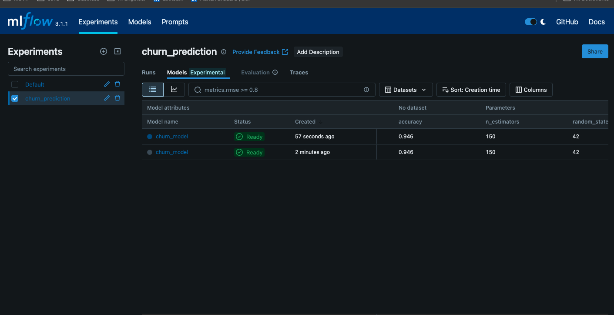
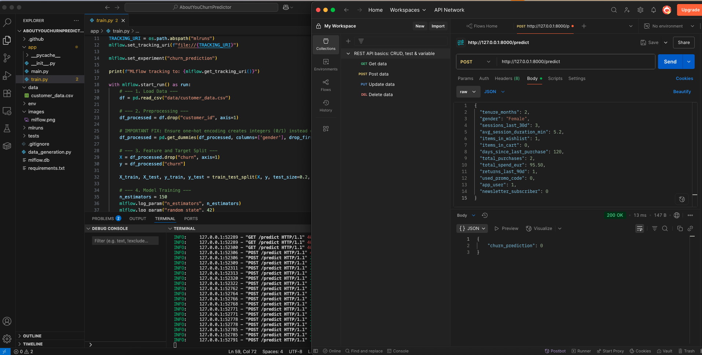

# ABOUT YOU – Customer Churn Predictor

### An End-to-End MLOps Pipeline for Proactive Customer Retention

This project presents a full-stack MLOps solution to predict customer churn for a fashion e-commerce platform like **ABOUT YOU**. It encompasses data versioning, experiment tracking, model training, and automated deployment through a REST API.

[](https://github.com/pythongurfer/AboutYouChurnPredictor/actions)

[](https://opensource.org/licenses/MIT)

---

## Business Context

In e-commerce, customer retention is both more cost-effective and strategically valuable than customer acquisition. This project addresses that challenge by implementing a machine learning pipeline that identifies users at high risk of churn. These insights can support targeted interventions—such as promotional offers or personalized outreach—to help improve customer retention and stabilize revenue.

---

## Project Scope

This project includes the following key components:

- **Data Version Control (DVC)** – Tracks changes in datasets and ensures reproducibility  
- **Experiment Tracking (MLflow)** – Logs all training runs, parameters, and performance metrics  
- **CI/CD Pipeline** – Automated testing and deployment using GitHub Actions  
- **Model Serving** – Production-ready inference API using FastAPI, containerized via Docker  

---

## System Architecture

The diagram below outlines the end-to-end MLOps workflow, from data ingestion to real-time prediction.


graph TD
    A[Data Source: customer_data.csv] --> B{DVC: Version Control}
    B --> C[Training Script: train.py]
    C -- Log Experiments --> D(MLflow Tracking Server)
    C -- Register Best Model --> E[MLflow Model Registry]
    E -- Loads Production Model --> F{FastAPI Prediction Service}
    F -- Containerized by --> G([Docker Image])
    H[API Request] -- JSON features --> F
    F -- churn: 0/1 --> H
    I{GitHub Actions} -- on push --> J[Run Pytests]
    J -- on success --> C


```markdown


### Live API Demo


